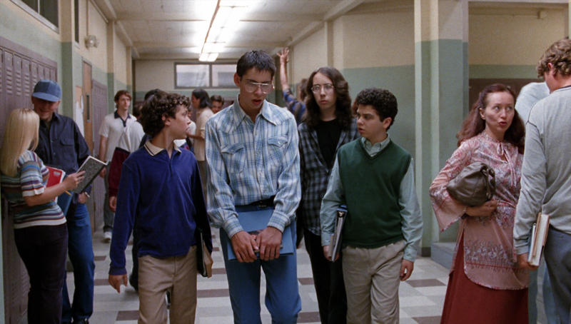

<strong><i> Fool me once - shame on you.  
Fool me twice - shame on me.  
Fool me all the time - welcome to the world of modern male fashion. </i></strong>

Lets face it, gentleman - to most of us fashion is a tough topic to talk about.  And, funny enough, it was never really your fault.

If you were lucky enough to be born a female the rules have always been easy - the more feminine you looked, the more attractive you became in the eyes of men.

That means that following the famous <i> "tight dress + high heels + long hair" </i> formula pretty much would always guarantee a solid stream of male attention. 

And, most importantly, literally EVERYBODY knows how it works. A girl would have to be deaf, blind and mute to not notice how patiently the TV, magazines and modern culture have been pushing this view on female fashion directly into brains of single generation of women.

<strong> But for us - men - things have been very much different. </strong>

Firstly, assuming you were not a son of Gianni Verscace or Karl Lagerferd throughout your early stages of life up until you stepped into your teenage years you're only fashion stylist was your mother (back then most fathers either had no sense of fashion whatsoever or were simply focused on "bringing in the money" and dressing their children was beyond their scope of concern).

And if you take a look at your family album from that times one of the key reason for your embarassment probably comes from looking at those gastly things your mother made you wear ;).

Secondly, quickly after reaching your highschool years you noticed that there were a few basic types of guys in your school:

<strong> 1. The Nerd </strong>

 https://filmfrolic.wordpress.com/2017/10/05/freaks-and-geeks-doesnt-make-high-school-seem-cool-but-thats-ok-nbc-teen-angst-growing-pains-analysis-why-it-was-cancelled-nbc/ 

Nerds were the type of guys still dressed by their mothers. Period. Not only were their outfits not "cool" judging by modern high school standards, but they also looked like something brought back straight from the early times of Commodore 64.

Combine a skinny, "muscle-free" body with a pair of thick glasses and clothes considered fashionable perhaps only in Soviet Russia and what you got was a recipe for a truly miserably looking kid who was completely invisible to almost every single girl in your school worth looking at.

He was certainly not the right source for your style inspiration.

<strong> 2. The Rock/Metal Guy </strong>

 [ PICTURES ]

Leather jacket? Check.    
A worn-out pair of jeans? Hmm.   
Long, poorly maintained hair? Am I looking at...    
An Iron Maiden/Metallica t-shirt? Of course! - the standard look of every teenage rebel.  

Compared to nerds rock/metal guys (i.e. people showing off their belonging to the rock or metal subculture) were definately higher on the social ladder, however but you always noticed a few issues with their lifestyle.

Firstly, since you've never felt the need to shout about your warm feelings towards icecream by dressing like an icecream cone, why would you be so blatant about the music you fancied?

Secondly, you realised that growing long hair was an option only for a small percentage of man and somehow you knew that growing an overly full head of hair would bring you closer to a homeless man rather than a rock star.

And thirdly, rock guys indeed were subject of some female affection, however theese feelings were coming mostly from girls proudly wearing red, green or pink hair, dark clothes and gore makeup and you didn't really fancy participating in blood drinking rituals.  

<strong> 3. The Rap Kid </strong>

 
